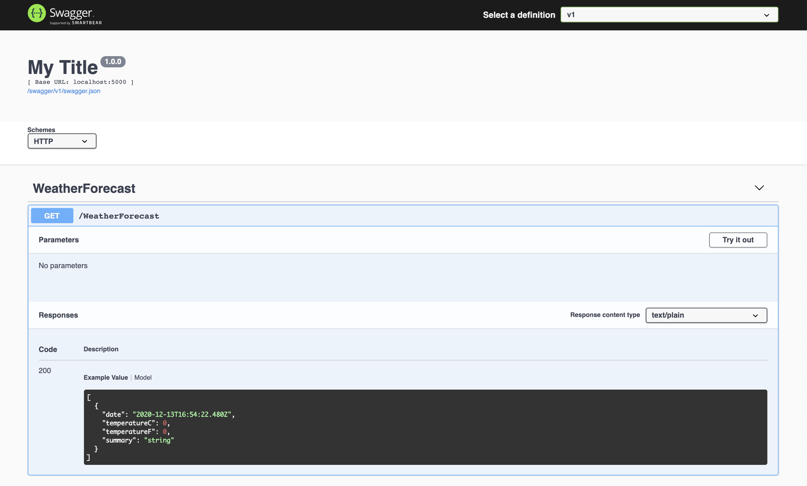

# Generate TypeScript and CSharp clients with NSwag based on an API

Generating clients for APIs is a tremendous way to reduce the amount of work you have to do when you're building a web project.  Why handwrite that code when it can be auto-generated for you by a tool like [NSwag](https://github.com/RicoSuter/NSwag)? To quote the docs:

> The NSwag project provides tools to generate OpenAPI specifications from existing ASP.NET Web API controllers and client code from these OpenAPI specifications.
> The project combines the functionality of Swashbuckle (OpenAPI/Swagger generation) and AutoRest (client generation) in one toolchain. 

There's some great posts out there that show you how to generate the clients with NSwag using an `nswag.json` file. This is a really great approach and [Sander Aernouts](https://github.com/sanderaernouts) has a [couple of great posts on this](https://github.com/sanderaernouts/autogenerate-api-client-with-nswag).

However, if you want to do some special customisation of the clients you're generating, you may find yourself struggling to configure that in `nswag.json`. In that case, it's possible to hook into NSwag directly to do this with a simple console app.

This post will:

- Create a .NET API which exposes a Swagger endpoint. (Alternatively, you could use any other Swagger endpoint; [for example an Express API](https://blog.logrocket.com/documenting-your-express-api-with-swagger/).)
- Create a .NET console app which can create both TypeScript and CSharp clients from a Swagger endpoint
- Consume that API in simple TypeScript front end

You will need both [Node.js](https://nodejs.org/en/) and the [.NET SDK](https://dotnet.microsoft.com/download) installed.

#### Create an API

To create an API which exposes a [Swagger / Open API](https://swagger.io/resources/open-api/) endpoint, we'll drop to the command line and enter the following commands:

```shell
mkdir src
cd src
mkdir server-app
cd server-app
dotnet new api -o API
cd API
dotnet add package NSwag.AspNetCore
```

We'll replace the `Startup.cs` that's been generated with the following:

```cs
using Microsoft.AspNetCore.Builder;
using Microsoft.AspNetCore.Hosting;
using Microsoft.Extensions.Configuration;
using Microsoft.Extensions.DependencyInjection;
using Microsoft.Extensions.Hosting;

namespace API
{
    public class Startup
    {
        const string ALLOW_DEVELOPMENT_CORS_ORIGINS_POLICY = "AllowDevelopmentSpecificOrigins";
        const string LOCAL_DEVELOPMENT_URL = "http://localhost:3000";

        public Startup(IConfiguration configuration)
        {
            Configuration = configuration;
        }

        public IConfiguration Configuration { get; }

        // This method gets called by the runtime. Use this method to add services to the container.
        public void ConfigureServices(IServiceCollection services)
        {

            services.AddControllers();

            services.AddCors(options => {
                options.AddPolicy(name: ALLOW_DEVELOPMENT_CORS_ORIGINS_POLICY,
                    builder => {
                        builder.WithOrigins(LOCAL_DEVELOPMENT_URL)
                            .AllowAnyMethod()
                            .AllowAnyHeader()
                            .AllowCredentials();
                    });
            });

            // Register the Swagger services
            services.AddSwaggerDocument();
        }

        // This method gets called by the runtime. Use this method to configure the HTTP request pipeline.
        public void Configure (IApplicationBuilder app, IWebHostEnvironment env)
        {
            if (env.IsDevelopment())
            {
                app.UseDeveloperExceptionPage();
            } 
            else
            {
                app.UseExceptionHandler("/Error");
                // The default HSTS value is 30 days. You may want to change this for production scenarios, see https://aka.ms/aspnetcore-hsts.
                app.UseHsts ();
                app.UseHttpsRedirection();
            }

            app.UseDefaultFiles();
            app.UseStaticFiles();

            app.UseRouting();

            app.UseAuthorization();

            // Register the Swagger generator and the Swagger UI middlewares
            app.UseOpenApi();
            app.UseSwaggerUi3();

            if (env.IsDevelopment())
                app.UseCors(ALLOW_DEVELOPMENT_CORS_ORIGINS_POLICY);

            app.UseEndpoints(endpoints =>
            {
                endpoints.MapControllers();
            });
        }
    }
}
```

The significant changes in the above `Startup.cs` are:

1. Exposing a Swagger endpoint with `UseOpenApi` and `UseSwaggerUi3`.  NSwag will automagically create swagger endpoints in your application for all your controllers. The .NET template ships with a `WeatherForecastController`.
2. Allowing [Cross-Origin Requests (CORS)](https://docs.microsoft.com/en-us/aspnet/core/security/cors) which is useful during development (and will facilitate a demo later).

Back in the root of our project we're going to initialise an npm project. We're going to use this to put in place a number of handy [`npm scripts`](https://docs.npmjs.com/cli/v6/using-npm/scripts) that will make our project easier to work with. So we'll `npm init` and accept all the defaults.

Now we're going add some dependencies which our scripts will use: `npm install cpx cross-env npm-run-all start-server-and-test`

We'll also add ourselves some `scripts` to our `package.json`:

```json
  "scripts": {
    "postinstall": "npm run install:server-app",
    "install:server-app": "cd src/server-app/API && dotnet restore",
    "start:server-app": "cross-env ASPNETCORE_URLS=http://*:5000 ASPNETCORE_ENVIRONMENT=Development dotnet watch --project src/server-app/API run --no-launch-profile"
  }
```

Now, running `npm install` will not only install dependencies for our root `package.json`, thanks to our `postinstall` and `install:server-app` scripts it will install the .NET dependencies as well. Running `npm run start:server-app` will start a .NET server at [http://localhost:5000](http://localhost:5000) (passing some environment variables with [`cross-env`](https://github.com/kentcdodds/cross-env) ).  Swagger can be found at [http://localhost:5000/swagger/index.html](http://localhost:5000/swagger/index.html):




Let's spin up the app and see what we have:


We now have an API to test with.  Please note, we're using .NET for our
